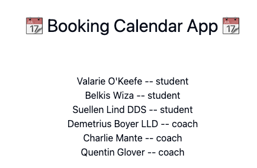
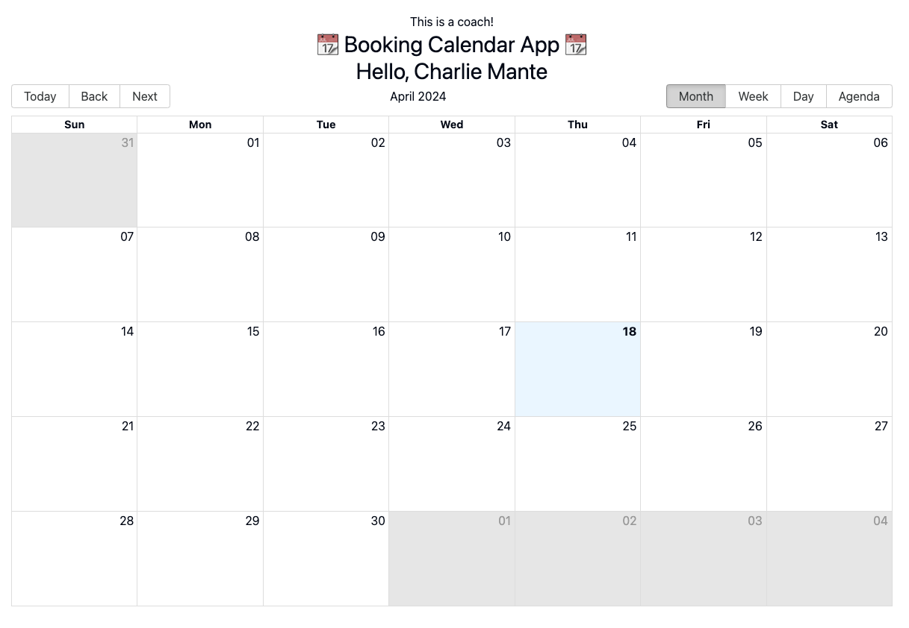
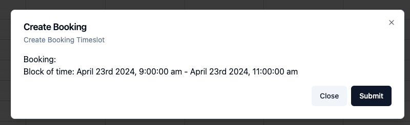
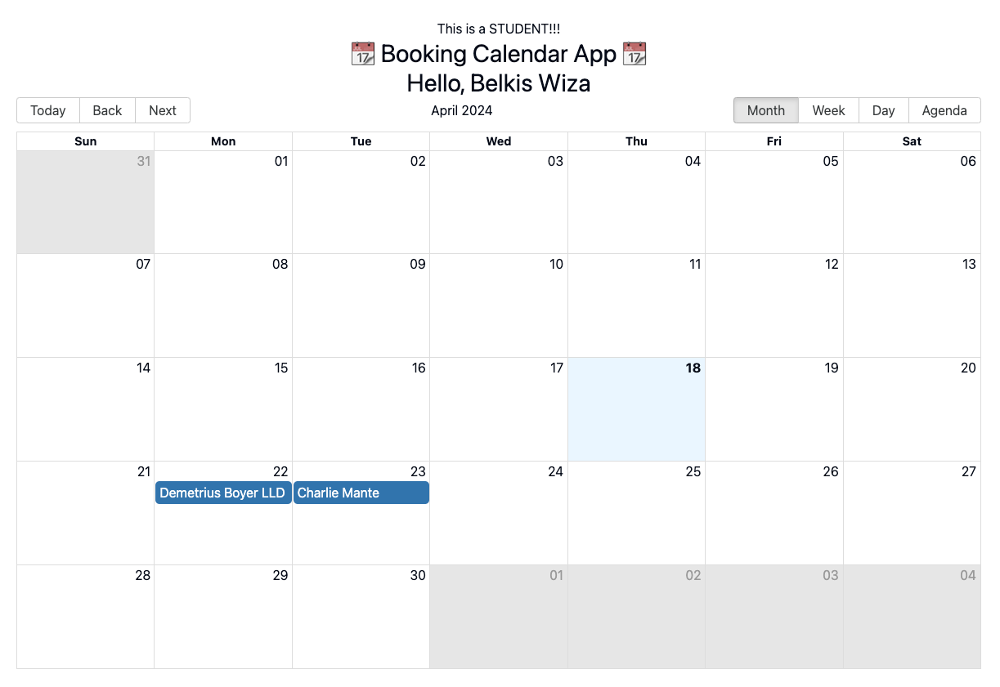
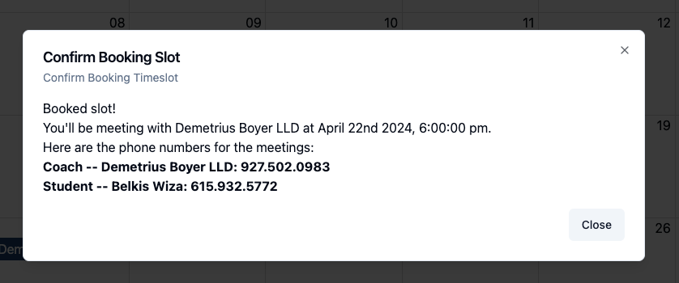
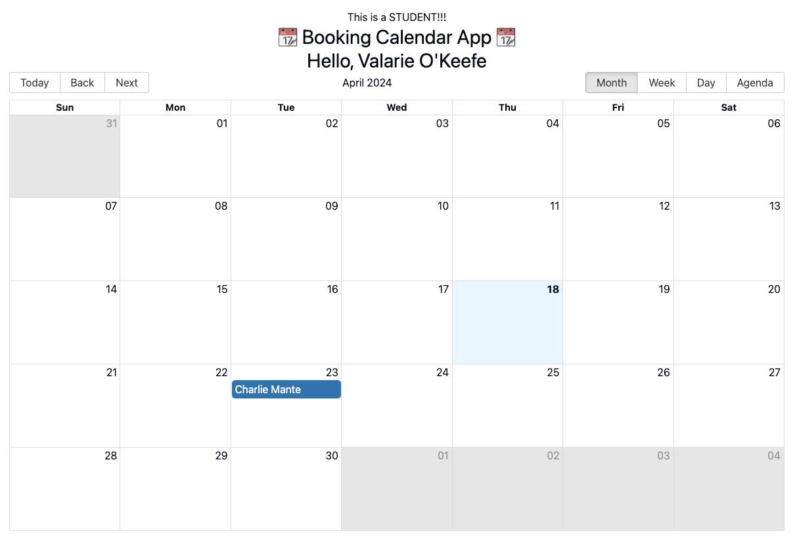
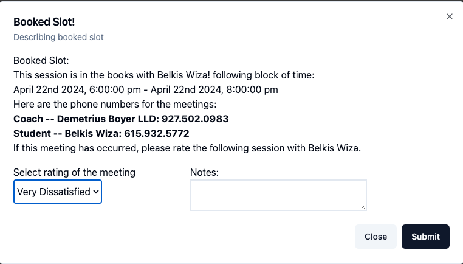
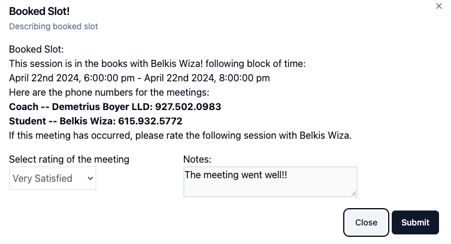

# Stepful Calendar App!!

Stepful is getting too busy! We have hundreds of 1-on-1 coaching calls between our students and coaches, and we need you to build a website to manage their scheduling.

Pre-requesites: 
- Ruby 3.3.0
- Node v20
- sqlite (gem "sqlite3")

 **One can run `./bin/setup` in the root of the project to set up the app. This should set up the DB, 
 and install all node packages needed.**

## How to Spin up the app:
- `foreman start`
- Head to the root of the application: [localhost:5173](http://localhost:5173)

## How the app works
The application will seed 6 different users: 3 students. 3 coaches. One can navigate back to the root url to switch between each user

While some schedules should be created, I would recommend going to a coach and creating different slots.

This is the screen for a coach:

When clicking on a particular date within the month screen, it should then go to the "Week" view and allow you to click a given time with a 30m increment

Note: Coaches will not see other coaches availability.

In the student view, we should see every coach that has an availability.

The student can see that two different coaches created some availability.

When a student has taken a slot, they can then check their availability information, including the phone number.

When a different student goes to their view, they will not see slots that other users have confirmed.

When a coach has met the student, they can leave a review! 

After the initial review, the coach will not be able to edit their notes.

## Decisions: 
### No tests
It pains me that this app was made with no tests, but I don't think I would've completed the 3hr time limit while test driving the application
### Using Vite vs Shakapacker Gem
While I had some issues with scaffolding the app using Shakapacker, I resulted in creating a new vite project within the rails codebase.
If I had more time, I would do my best to iron this out.

### Using Shadcn
I wanted to use a UI framework, but some of it could use some tweaking. 

### React Big Calendar
While I was looking for a decent calendar package, React Big Calendar had the best documentation needed to spin up the app.
Some of it wasn't as intuitive, but I managed to get this sorted.

## Necessary Refactors:

### Refactor Calendar View to a smart component, regardless of user type.
I created two separate CalendarViews because I wanted to ensure that I had different behavior working correctly for each type of user. 
If I had more time, I would bubble up any of the similarities (Similar to the Dialog Template component)

### Create a DialogTemplate for the Student View.
Maybe using the props.children for the template so it can render any type of view.

### Serializer
Right now, the json returns snake case for values. I often will change it to camel case. The API should have a serializer
so that it follows json convention.

## Last Words:
Thanks for the opportunity. Any feedback will be appreciated. My email is [mnunez903@gmail.com](mailto:mnunez903@gmail.com)

As mentioned before, I've been interested in learning Go, so I plan to continue working on this apps back-end.

